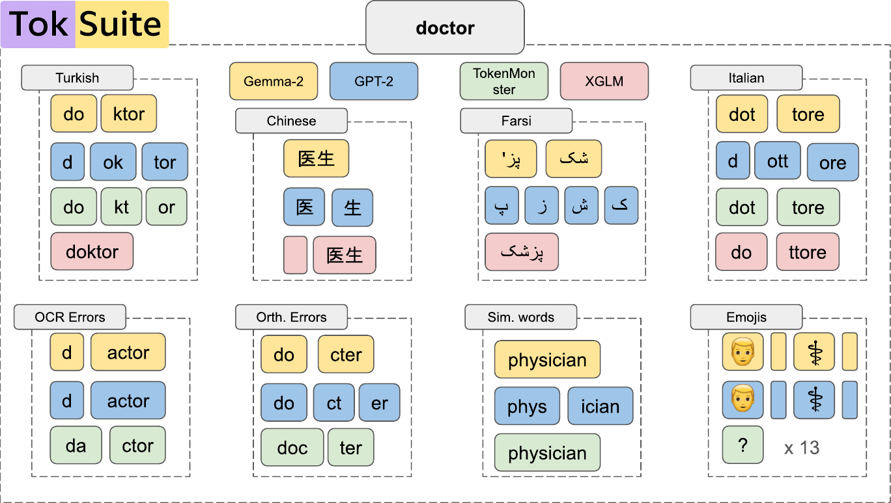

<div align="center">
  <br>
  <h1>TokSuite</h1>
  <h4>A controlled suite for measuring the impact of tokenizer choice on language model behavior.</h4>
</div>



<p></p>

<p align="center">
  <a href="https://github.com/r-three/TokSuite">
    </a>
  <a href="https://github.com/r-three/lingua/tree/toksuite">
    </a>
  <a href="https://huggingface.co/collections/toksuite/toksuite-model-collection">
    </a>
  <a href="https://huggingface.co/collections/toksuite/toksuite-benchmarks">
    </a>
  <a href="https://huggingface.co/spaces/toksuite/leaderboard">
    </a>
  <a href="https://huggingface.co/spaces/toksuite/tokenizer-comparison">
    </a>
  <a href="https://arxiv.org/abs/2512.20757">
    </a>
  <a href="https://github.com/r-three/TokSuite/blob/main/LICENSE">
    </a>
</p>

---

**TokSuite** is a collection of models and a benchmark designed for studying how tokenizer choice affects language model behavior. By training multiple 1B-parameter models with identical architectures, data, and training budgets, varying only the tokenizer, TokSuite enables clean scientific ablations that isolate tokenization effects from confounding variables.

- **Controlled by design**: Same architecture, dataset, training budget, and initialization — only the tokenizer changes.
- **Broad coverage**: 14 tokenizers evaluated, ranging from character-level and byte-level to subword tokenizers from major model families.
- **New robustness benchmark**: A custom multilingual evaluation dataset testing model sensitivity to real-world text perturbations that affect tokenization (orthographic noise, diacritics, OCR artifacts, Unicode variants, and more).
- **Multilingual focus**: The models are trained on English, Chinese, Turkish, Italian, and Farsi, and the parallel benchmark captures real-world perturbations across all five languages by applying them to the same canonical questions translated into each target language.
- **Fully open**: Code, models, datasets, and paper are all publicly released.

See our paper for details: https://arxiv.org/abs/2512.20757

## Table of Contents

- [Models](#models)
- [Datasets](#datasets)
- [Spaces](#spaces)
  - [Leaderboard](#leaderboard)
  - [Tokenizer Comparison](#tokenizer-comparison)
  - [TokSuite Pretraining Data](#toksuite-pretraining-data)
  - [TokSuite Robustness Benchmark](#toksuite-robustness-benchmark)
- [Set-up](#set-up)
  - [On Killarney](#on-killarney)
- [Usage](#usage)
  - [Computing Intrinsic Tokenizer Metrics](#computing-intrinsic-tokenizer-metrics)
  - [Running Evaluation](#running-evaluation)
    - [Running on an HPC Cluster (SLURM)](#running-on-an-hpc-cluster-slurm)
  - [Comparing Tokenizers](#comparing-tokenizers)
- [Training](#training)
  - [Extracting tiktoken Vocabulary Files](#extracting-tiktoken-vocabulary-files)
  - [Building the Super-Vocabulary](#building-the-super-vocabulary)
- [Converting Supertoken Models](#converting-supertoken-models)
- [Plotting and Reproducibility](#plotting-and-reproducibility)
- [Citation](#citation)
- [License](#license)

## Models

We release 14 controlled 1B-parameter models, each trained with a different tokenizer under identical conditions (Llama-3.2-1B architecture, ~100B token training budget). Browse evaluation results on the [leaderboard](https://huggingface.co/spaces/toksuite/leaderboard).

| Tokenizer | Method | Vocab. Size | Languages | HuggingFace |
|-----------|--------|-------------|-----------|-------------|
| ByT5 | Bytes | 259 | Language-agnostic | [toksuite/google-byt5-small](https://huggingface.co/toksuite/google-byt5-small) |
| TokenMonster | Custom | 32,000 | English-only | [toksuite/tokenmonster-englishcode-32000-consistent-v1](https://huggingface.co/toksuite/tokenmonster-englishcode-32000-consistent-v1) |
| Phi-3 | BPE | 32,064 | Multilingual | [toksuite/microsoft-Phi-3-mini-4k-instruct](https://huggingface.co/toksuite/microsoft-Phi-3-mini-4k-instruct) |
| GPT-2 | BPE | 50,257 | English-only | [toksuite/gpt2](https://huggingface.co/toksuite/gpt2) |
| Comma | BPE | 64,000 | Multilingual | [toksuite/common-pile-comma-v0.1](https://huggingface.co/toksuite/common-pile-comma-v0.1) |
| mBERT | WordPiece | 110,000 | Multilingual | [toksuite/google-bert-bert-base-multilingual-cased](https://huggingface.co/toksuite/google-bert-bert-base-multilingual-cased) |
| Llama-3.2 | BPE | 128,256 | Multilingual | [toksuite/meta-llama-Llama-3.2-1B](https://huggingface.co/toksuite/meta-llama-Llama-3.2-1B) |
| Tekken | BPE | 130,000 | Multilingual | [toksuite/mistralai-tekken](https://huggingface.co/toksuite/mistralai-tekken) |
| Qwen-3 | BPE | 151,646 | Multilingual | [toksuite/Qwen-Qwen3-8B](https://huggingface.co/toksuite/Qwen-Qwen3-8B) |
| GPT-4o | BPE | 200,000 | Multilingual | [toksuite/tiktoken-gpt-4o](https://huggingface.co/toksuite/tiktoken-gpt-4o) |
| BLOOM | BPE | 250,680 | Multilingual | [toksuite/bigscience-bloom](https://huggingface.co/toksuite/bigscience-bloom) |
| Aya | BPE | 255,029 | Multilingual | [toksuite/CohereLabs-aya-expanse-8b](https://huggingface.co/toksuite/CohereLabs-aya-expanse-8b) |
| XGLM | Unigram | 256,008 | Multilingual | [toksuite/facebook-xglm-564M](https://huggingface.co/toksuite/facebook-xglm-564M) |
| Gemma-2 | Unigram | 256,128 | Multilingual | [toksuite/google-gemma-2-2b](https://huggingface.co/toksuite/google-gemma-2-2b) |

All models share the same initialization via a **super-vocabulary** approach, ensuring fair comparison.

## Datasets

### TokSuite Pretraining Data
A multilingual corpus of ~100B tokens used to train all suite models:
- 40B tokens from [FineWeb-Edu](https://huggingface.co/datasets/HuggingFaceFW/fineweb-edu) (English)
- 60B tokens distributed across Chinese, Turkish, Italian, and Farsi

Available at: [toksuite/toksuite-pretraining-data](https://huggingface.co/collections/toksuite/training-data-detokenized)

### TokSuite Robustness Benchmark
A parallel collection of multiple-choice text completion questions paired with a wide range of real-world surface-form perturbations that are known to interact strongly with tokenization covering English, Farsi, Turkish, Italian, and Chinese languages as well as STEM and Math domains.

Available at: [toksuite/toksuite-robustness](https://huggingface.co/collections/toksuite/toksuite-benchmarks)

## Spaces

### Leaderboard

Explore evaluation results across all 14 TokSuite models and tasks: [toksuite/leaderboard](https://huggingface.co/spaces/toksuite/leaderboard)

### Tokenizer Comparison

Interactively visualize how different tokenizers segment any text: [toksuite/tokenizer-comparison](https://huggingface.co/spaces/toksuite/tokenizer-comparison)

## Set-up
We recommend using uv (install it with `pip install uv` or install from [https://astral.sh/uv/install.sh](https://astral.sh/uv/install.sh) if not already available). Use r-three lm-eval fork until [this](https://github.com/EleutherAI/lm-evaluation-harness/pull/3834) PR is merged to lm-eval. 

### On Killarney
On the Killarney cluster (Compute Canada), you need to first load the following modules:
```bash
module load StdEnv/2023  gcc/13.3  openmpi/5.0.3 cuda/12.6 python/3.10.13
```
and for the first time you run the code, you need to install the packages to the system:
```bash
curl -LsSf https://astral.sh/uv/install.sh | sh
```

```bash
# If you don't have a virtual environment already, you can either
# 1. Install the packages to the system (though we don't recommend this)
uv pip install -e . --system

# 2. Create a venv with uv
# make sure to load cuda (locally built with cuda-12.4)
uv venv --python 3.10
source .venv/bin/activate
## First run
uv sync --extra build
uv sync --all-extras
# on machines w/o cuda
uv sync --all-extras --all-groups  --no-install-package flash-attn
```
If you have another uv venv, you can add this package to the original projects `pyproject.toml` as below and run `uv sync --extra tokenizers` in the main directory:
```toml
[project.optional-dependencies]
tokenizers = ["toksuite"]

[tool.uv.sources]
toksuite = { path = "../toksuite", editable = true }
```

## Usage

### Computing Intrinsic Tokenizer Metrics

Compute fertility, parity, proportion of continued words (PCW), and vocabulary overlap across tokenizers and languages:

```bash
# Run all analyses for all 14 TokSuite tokenizers across all 5 languages
python -m toksuite.scripts.calculate_intrinsic_tokenizer_metrics \
  --tokenizers all \
  --languages all \
  --analyses all

# Run specific analyses for a subset of tokenizers
python -m toksuite.scripts.calculate_intrinsic_tokenizer_metrics \
  --tokenizers "GPT-2,Llama-3.2,BLOOM" \
  --languages all \
  --analyses fertility,parity,pcw

# Use custom tokenizers not in the default list (JSON mapping)
python -m toksuite.scripts.calculate_intrinsic_tokenizer_metrics \
  --tokenizers '{"My tokenizer": "org/my-model"}' \
  --languages all \
  --analyses fertility
```

**`--tokenizers`**: `all` to use all 14 TokSuite tokenizers, a comma-separated list of shortnames, or a JSON dict mapping display name → HuggingFace path. Supported shortnames: `Comma`, `Llama-3.2`, `Phi-3`, `GPT-2`, `GPT-4o`, `BLOOM`, `XGLM`, `Tekken`, `ByT5`, `mBERT`, `Qwen-3`, `TokenMonster`, `Gemma-2`, `Aya`.

**`--languages`**: `all` for all 5 languages (English, Chinese, Turkish, Farsi, Italian), or a comma-separated list of Flores-200 column keys (`sentence_eng_Latn`, `sentence_zho_Hans`, `sentence_tur_Latn`, `sentence_pes_Arab`, `sentence_ita_Latn`).

**`--analyses`**: `all`, or a comma-separated subset of: `vocab_sizes`, `vocab_overlap`, `fertility`, `parity`, `pcw`, `example_tokenizations`.

**`--dataset_name`**: HuggingFace dataset to use for text-based analyses (default: `Muennighoff/flores200`). **`--sample_size`**: number of examples to sample (default: `10000`). **`--sample_sentence`**: sentence used for `example_tokenizations` (default: `"Hello World"`). **`--dataset_path`**: local path to a pre-saved Arrow dataset (see note below).

Outputs are saved as CSV files and plots (`.png`) in the current directory.

> **Note — Flores-200 compatibility:** `datasets >= 3.0` dropped support for Python-based loading scripts, but `Muennighoff/flores200` uses one. If you are running with `datasets >= 3.0`, loading the dataset will fail with `RuntimeError: Dataset scripts are no longer supported`. To work around this, save the dataset to disk once using an older version, then pass the path via `--dataset_path`:
>
> ```bash
> pip install "datasets==2.21.0"
> python -c "
> from datasets import load_dataset
> ds = load_dataset('Muennighoff/flores200', 'all', split='dev', trust_remote_code=True)
> ds.save_to_disk('/path/to/flores200_dev')
> "
> pip install "datasets==3.6.0"   # restore your version
> ```
>
> Then pass `--dataset_path /path/to/flores200_dev` when running the script. The `calculate_intrinsic_tokenizer_metrics.sh` convenience script handles this automatically on first run.

### Running Evaluation

TokSuite tasks are available on [lm-evaluation-harness](https://github.com/EleutherAI/lm-evaluation-harness/blob/95d580638385578c1c07fa554cf16ad7f5b5f460/lm_eval/tasks/toksuite/). We provide sample scripts to run evaluation under [.slurm_scripts](./slurm_scripts/).

You can override any config field from the command line, or create your own YAML config pointing to any HuggingFace model.

Note that you need the most recent lm-eval to run evaluation for tokenmonster, tiktoken, and tekken TokSuite models.

#### Running on an HPC Cluster (SLURM)

Convenience SLURM scripts are provided for batch evaluation on an HPC cluster:

```bash
# Evaluate a single model across all tasks (interactive-style; edit flags inside script)
sbatch slurm_scripts/eval_all_toksuite_models.sh

# Run the common-benchmarks suite across all TokSuite models
sbatch slurm_scripts/eval_toksuite_on_common_benchmarks.sh
```

> **Before submitting**, update the paths, account name, and GPU partition at the top of each script. The defaults target the Killarney cluster.

Note on tokenizer backends:

- The SLURM scripts auto-detect special tokenizer runtimes and pass a `tokenizer_backend` value to the evaluation harness via `--model_args`.
- `tokenmonster` refers to the TokenMonster tokenizer (a custom implementation) and is handled by passing `tokenizer_backend=tokenmonster` so the harness uses the TokenMonster runtime.
- `tekken` (the `mistralai-tekken` tokenizer in our models) is part of the Mistral family and is handled via the `mistral` backend (`tokenizer_backend=mistral`).

If you add other non-standard tokenizers, update the detection logic in `slurm_scripts/eval_toksuite_on_common_benchmarks.sh` to set the correct `tokenizer_backend`.

### Comparing Tokenizers

Analyze and visualize how different tokenizers segment text interactively on the [Tokenizer Comparison Space](https://huggingface.co/spaces/toksuite/tokenizer-comparison), or run locally:

```bash
token-alysis \
  --tokenizers meta-llama/Llama-3.2-1B Qwen/Qwen3-8B \
  --text "Your input text here"
```


## Training
We use lingua framework to train our models, please refer to [r-three/lingua](https://github.com/r-three/lingua/tree/toksuite) for more information on training. 

In this repository, we provide auxilary files for Lingua.

#### Extracting tiktoken Vocabulary Files

For tiktoken-based tokenizers (gpt-4o, gpt-4), Lingua — the tokenizer backend used during evaluation — requires a local `.tiktoken` file. Generate one before running evaluation on those models:

```bash
python -m toksuite.scripts.create_tiktoken gpt-4o \
    --output vocabs/tiktoken-gpt-4o/gpt-4o.tiktoken
```

| Model / alias | Encoding |
|---|---|
| `gpt-4o`, `gpt-4o-mini` | `o200k_base` |
| `gpt-4`, `gpt-3.5-turbo` | `cl100k_base` |
| `gpt-3`, `gpt-2` | `r50k_base` |

HuggingFace-backed tokenizers (Llama, Mistral, BLOOM, etc.) do not need this step.

### Building the Super-Vocabulary

To reproduce the TokSuite models, you first need to build the **super vocabulary** described in Section 3.2 of the paper. The super vocabulary is the union of all 14 tokenizer vocabularies (normalized to UTF-8 bytes), along with per-tokenizer alignment mappings used to initialize shared embedding weights across models. For convenience we provide initial checkpoints for every model used in the paper at [toksuite/initializations](https://huggingface.co/collections/toksuite/initializations), please note that this supervocab contains 19 models (5 more than the models used in the paper) but the corresponding initializations for each model is consistent.

Run the script, which handles the tiktoken extraction and vocab build in one step:

```bash
bash toksuite/scripts/build_super_vocab.sh
```

> **Before running**, update the `SCRATCH` path at the top of `build_super_vocab.sh` to point to your own scratch or cache directory. This keeps model downloads out of your home directory.

To use a custom set of tokenizers instead, invoke the Python module directly:

```bash
python -m toksuite.scripts.super_vocab \
  --tokenizers \
    google/byt5-small \
    toksuite/tokenmonster-englishcode-32000-consistent-v1 \
    microsoft/Phi-3-mini-4k-instruct \
    openai-community/gpt2 \
    nikandish/common-pile-comma-v0.1 \
    google-bert/bert-base-multilingual-cased \
    meta-llama/Llama-3.2-1B \
    mistralai/Mistral-7B-v0.3 \
    Qwen/Qwen3-8B \
    vocabs/tiktoken-gpt-4o/gpt-4o.tiktoken \
    bigscience/bloom \
    CohereLabs/aya-expanse-8b \
    facebook/xglm-564M \
    google/gemma-2-2b \
  --output_dir vocabs/
```

**Outputs** in `vocabs/`:

| File | Description |
|------|-------------|
| `super_vocab.json` | Master vocabulary mapping token string → super-vocab index |
| `{tokenizer}_super_mapping.json` | Per-tokenizer alignment: original token ID → super-vocab ID |
| `{tokenizer}_vocab.json` | Original vocabulary for each tokenizer |
| `{tokenizer}.yaml` | Tokenizer metadata |

The `super_vocab.json` and `*_super_mapping.json` files are then used as the embedding initialization for model training (see Section 3.2 of the [paper](https://arxiv.org/abs/2512.20757)).


## Converting Lingua Models 
```bash


model="gpt2"
tokenizer="gpt2"
model_name="craffel/supertoken_models"
model_path="$model_name/$model/"
tokenizer_name="blester125/supervocab-$tokenizer"
hf_model_path="$PROJECT/models/$model_name"
tokenizer_path="$PROJECT/tokenizers/$tokenizer"
hf_out_path="gsaltintas/supertoken_models-llama_$model"

# Create directories
mkdir -p "$hf_model_path"
mkdir -p "$hf_model_path"

huggingface-cli download $model_name --local-dir=$hf_model_path
huggingface-cli download $tokenizer_name --local-dir=$tokenizer_path
# Convert LLaMA weights to HuggingFace format
echo "Converting model weights to HuggingFace format..."
python -m xarch_tokenizers.scripts.convert_supertoken_models \
    --input_dir "$hf_model_path/$model" \
    --model_size 1B \
    --output_dir "$hf_model_path" \
    --llama_version 3 --tokenizer_version 3 \
    --tokenizer_path "$tokenizer_path" \
    --push_to_hub --output_dir $hf_out_path \
    --only_model --public

# Run lm_eval with converted model
## TODO: clean
echo "Running lm_eval..."
lm_eval \
--model hf --model_args "pretrained=$hf_out_path,tokenizer=$tokenizer" \
--device cuda \
--tasks toksuite \
--log_samples \
--verbosity DEBUG \
--output_path "results/tokenization_robustness/v102-cleaned/supertoken/$model"
```

## Plotting and Reproducibility
Here we list ways to reproduce the figures from the paper:
- Figure 3-4-5: Run `notebooks/intrinsic-metrics-plots.ipynb`
- Table 1:
- Figure 7:
- Figure 8 and Table 6 (Canonical Accuracy):
It's fairly easy to reproduce the tables from the paper using toksuite utils on the lm-eval repo

## Citation

If you use TokSuite in your work please cite the paper below. BibTeX entries are provided for convenience.

```bibtex
@inproceedings{altintas2026toksuite,
  author       = {G{"u}l Sena Altınta\c{s} and Malikeh Ehghaghi and Brian Lester and Fengyuan Liu and Wanru Zhao and Marco Ciccone and Colin Raffel},
  title        = {{TokSuite}: Measuring the Impact of Tokenizer Choice on Language Model Behavior},
  booktitle    = {Proceedings of the 43rd International Conference on Machine Learning (ICML)},
  year         = {2026},
  eprint       = {2512.20757},
  archivePrefix= {arXiv},
  url          = {https://arxiv.org/abs/2512.20757}
}
```


## License

This project is licensed under the MIT License — see the [LICENSE](LICENSE) file for details.
